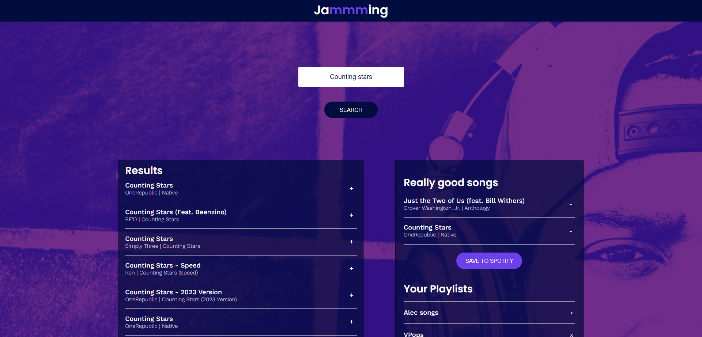

# Jamming

## Overview
This is a ReactJS application that uses the Spotify API to allow users to search the Spotify library, create a custom playlist, then save it to their Spotify account.

## Technologies Used
* ReactJS
* Spotify API
* HTML/CSS
* JavaScript
* NodeJS

## Features
* Search the Spotify library by song title, artist, or album
* Add songs to a custom playlist
* Save the custom playlist to your Spotify account
* View your Spotify playlists
* Remove songs from your custom playlist
* Change the name of your custom playlist

## How to Run
1. Clone the repository
2. Run `npm install`
3. Run `npm start`
4. Open [http://localhost:3000](http://localhost:3000) to view it in the browser.

## Preview

## Live Demo
[Jamming](https://nhanbin03-jamming.netlify.app)

## License
This project is licensed under the MIT License - see the [LICENSE.md](LICENSE.md) file for details.

## Acknowledgements
* [Codecademy](https://www.codecademy.com/)
* [Spotify](https://www.spotify.com/)
* [Netlify](https://www.netlify.com/)
